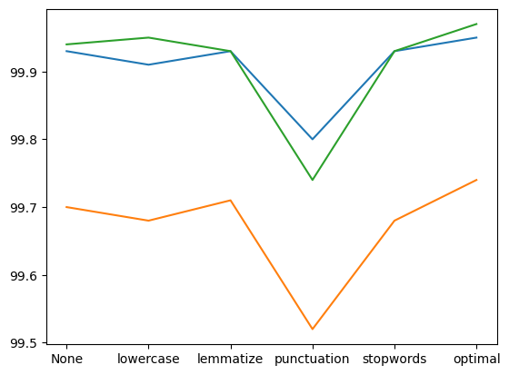
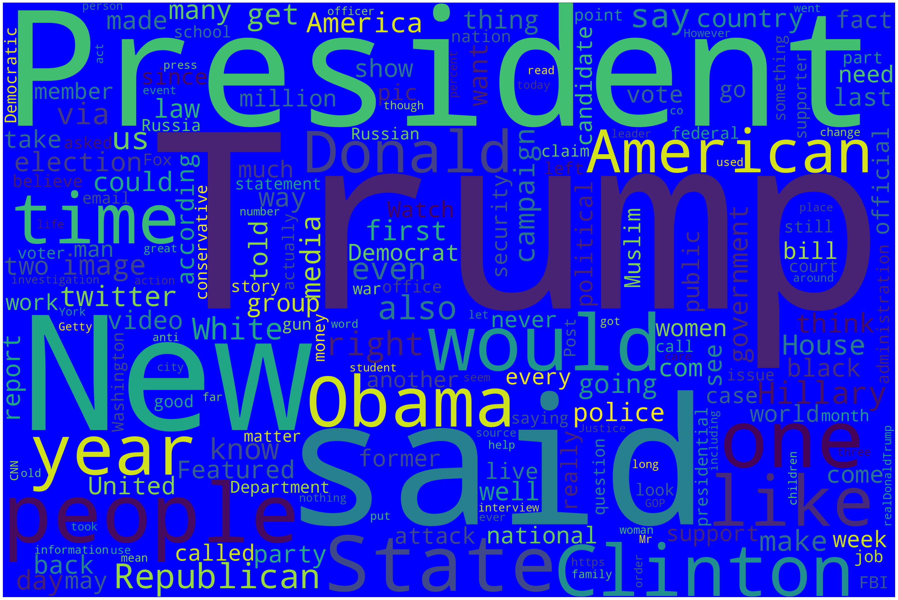
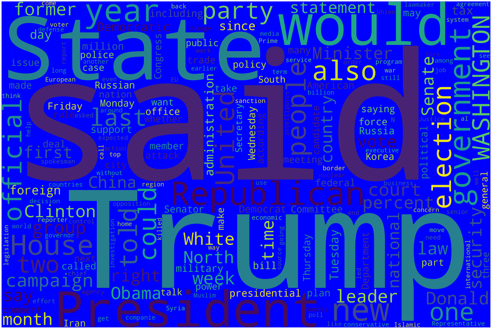
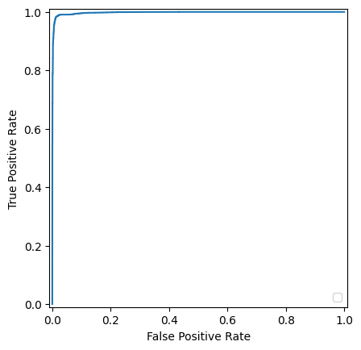

# Fake News Detection using Natural Language Processing

## Quick Results

| Metric | Value |
|---------|------:|
| Best Model | Logistic Regression |
| Best Accuracy | **98.76%** |
| Models Evaluated | 3 |
| Custom Tokenizers | 3 |
| Vocabulary Size | 1,000 features |
| Publication | *Journal of Student Research* |

---

## Highlights

* Built an end-to-end NLP classification pipeline in Python
* Implemented three custom tokenization strategies for text preprocessing
* Compared multiple machine learning models (Logistic Regression, SVM, Linear SVC)
* Evaluated the impact of individual preprocessing techniques (single-case format, lemmatizer, punctuation removal, stopword removal)
* Performed error analysis on misclassified articles
* Visualized model performance using ROC curves, accuracy comparisons, and word clouds
* Published the resulting research in the *Journal of Student Research*

---

## Overview

This project explores how different natural language preprocessing techniques affect the performance of machine learning models for fake news detection. Using a labeled dataset of news articles, I built multiple text preprocessing pipelines, trained several classification models, analyzed feature importance, and evaluated the effect of preprocessing choices on model performance.

The work culminated in a research paper that was published in the *Journal of Student Research*.

---

## Dataset

The dataset used in this project is publicly available on Kaggle.

Because of GitHub file size limitations and licensing considerations, it is **not included** in this repository.

You can download it here:

[Kaggle Fake News Dataset](https://www.kaggle.com/datasets/clmentbisaillon/fake-and-real-news-dataset)

The dataset contains 23502 fake news articles and 21417 true news articles. There are four columns: Title, Text, Subject, Date. Only the Title and Text columns were used in this project.

---

## Text Preprocessing

To investigate the effect of preprocessing on classification performance, the pipeline includes:

* Lowercasing all text
* Stop word removal
* Removal of news outlet names
* Lemmatization using NLTK
* CountVectorizer (`max_features=1000`)

Three tokenization approaches were implemented:

1. **Whitespace tokenizer**

   * Splits only on whitespace.

2. **Boundary punctuation tokenizer**

   * Separates punctuation appearing at the beginnings or ends of words.

3. **Full punctuation tokenizer**

   * Splits on all punctuation, including punctuation appearing within words.

The project also evaluates the impact of enabling or disabling lowercasing, stop-word removal, punctuation removal, and lemmatization on model performance. The effects of each individual preprocessing step on the models is depicted below.



## Word Frequency Visualization

The word clouds below depict the most common words among real and fake articles after text preprocessing.

| Fake News | Real News |
|------------|-----------|
|  |  |

---

## Models

The following supervised learning models were trained and evaluated:

| Model               |   Accuracy |
| ------------------- | ---------: |
| Logistic Regression | **98.76%** |
| SVM (RBF Kernel)    |     98.72% |
| Linear SVC          |     98.54% |

---

## Model Analysis

Beyond reporting accuracy, the project includes several analyses to better understand model behavior.

### Feature Importance

The Logistic Regression model assigns learned weights to each vocabulary term. Examining these coefficients identifies words that most strongly indicate whether an article is likely to be classified as real or fake.

### Hyperparameter Tuning

Linear SVC performance was evaluated across multiple values of the regularization parameter **C** (0.2–2.2) to study its effect on classification accuracy.

### Error Analysis

False positives and false negatives were examined to better understand the types of articles that were difficult to classify.

### ROC Curve

Receiver Operating Characteristic (ROC) curves were generated to visualize the tradeoff between true positive rate and false positive rate.



---

## Visualizations

The notebook includes visualizations such as:

* Word clouds for real and fake news articles
* Model accuracy comparisons
* Preprocessing technique comparisons
* ROC curves
* Linear SVC hyperparameter tuning

---

## Technologies

* Python
* pandas
* NumPy
* NLTK
* scikit-learn
* matplotlib
* WordCloud
* Jupyter Notebook

---

## Repository Structure

```
.
├── README.md
├── requirements.txt
├── LICENSE
├── .gitignore
│
├── notebooks/
│   └── fake_news_detection.ipynb
│
├── src/
│   ├── preprocessing.py
│   ├── tokenizers.py
│   ├── models.py
│   └── visualization.py
│
├── images/
│   ├── wordcloud_fake.png
│   ├── wordcloud_real.png
│   ├── preprocessing_comparison.png
│   ├── roc_curve.png
│   └── linear_svc_c_values.png
│
└── data/
    └── README.md
```

---

## Results

The highest-performing model was Logistic Regression, achieving **98.76% classification accuracy** while remaining highly interpretable through analysis of learned feature weights.

The experiments demonstrate that careful preprocessing has a measurable impact on model performance and provide insight into which preprocessing steps contribute most to accurate fake news classification.

---

## Publication

This work was developed through an independent research project conducted under the guidance of an Inspirit AI mentor and was later published in the *Journal of Student Research*.

**Paper:** [Detecting Fake News Using Machine Learning](https://www.researchgate.net/publication/370514397_Detecting_Fake_News_Using_Machine_Learning)

*The findings shown in the paper differ slightly to those listed above due to revisiting the project years later.*

---

## Future Improvements

Potential extensions include:

* Remove metadata from articles
* Cross-validation
* TF-IDF instead of CountVectorizer
* Word embeddings (Word2Vec, GloVe)
* Transformer-based models (BERT, RoBERTa)
* Explainability (SHAP)

---

*This project was completed under the guidance of a research mentor through weekly meetings and iterative experimentation.*

---